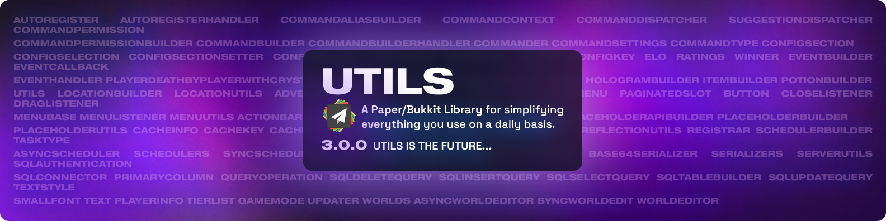

# Welcome to Utils!
Utils is a Paper/Bukkit Library for simplifying everything you use on a daily basis.

**Some features include:**
- GUI Menus
- Very advanced commands using Commander or CommandBuilder
- Easy to use SQL
- An ItemBuilder so you can shorten your ItemStack code
- and more...
##  Documentation:
#### https://manered.gitbook.io/utils/getting-started
